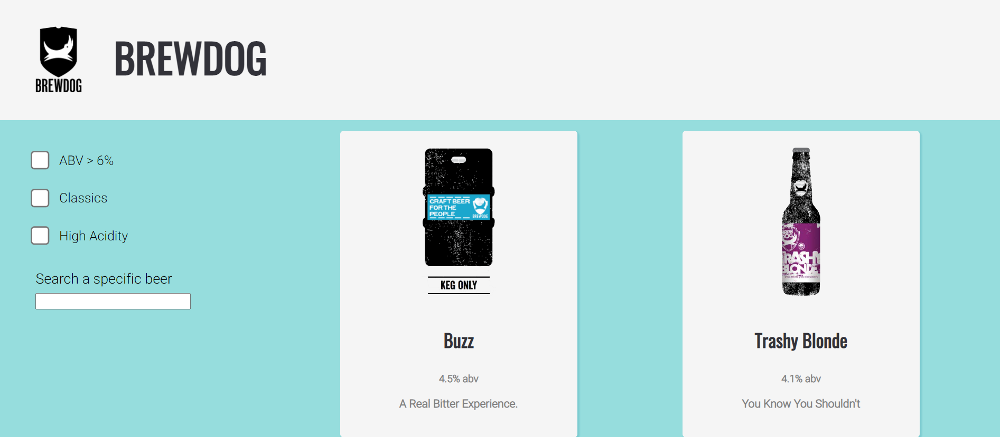
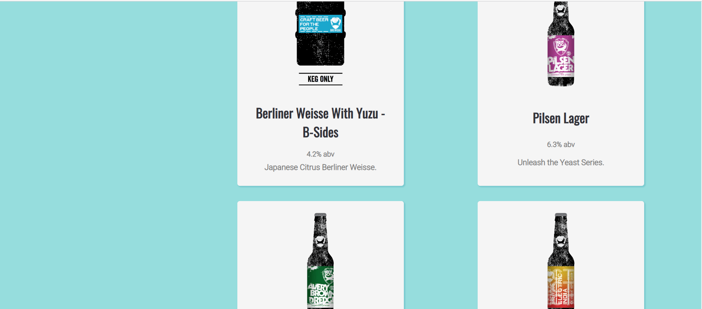
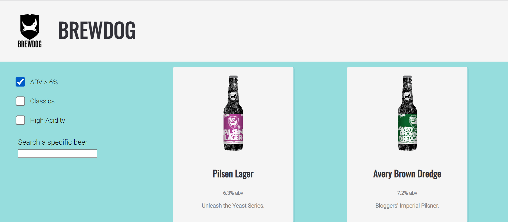
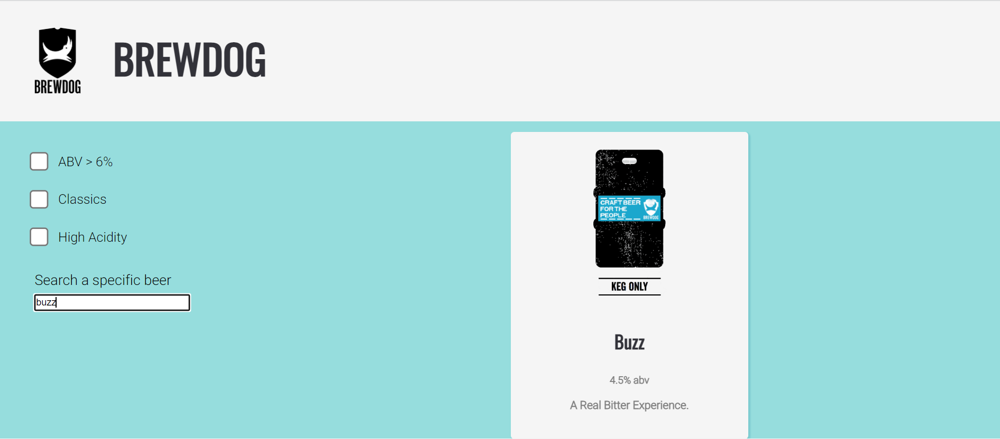
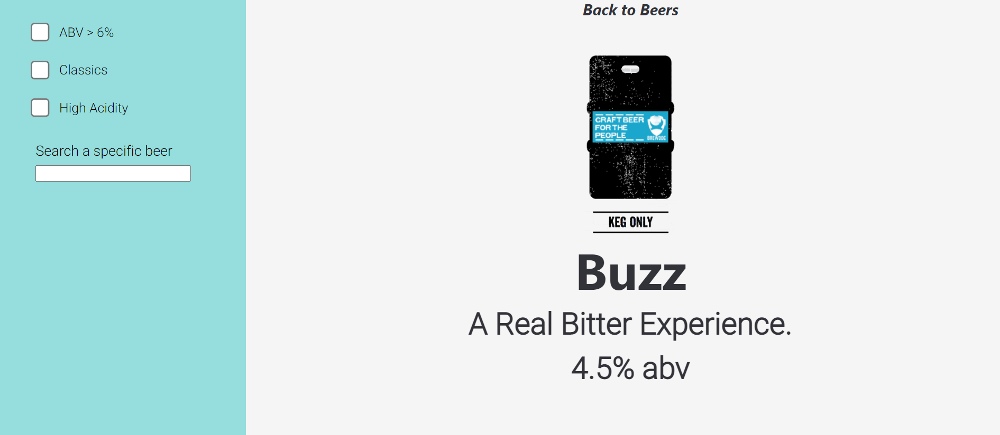

# punk-api project

## Table of Contents
- [Brief](#brief)
- [About](#about)
- [Screenshots](#screenshots)
- [Languages](#languages)
- [Code of Note](#code_of_note)
- [Bugs to fix](#bugs_to_fix)

## Brief 

1. Built entirely in React
2. Repository on GitHub
3. Use the Punk API (after using the data file first) (https://punkapi.com/)
4. Search functionality
5. Filter functionality:    -High Alcohol (ABV value greater than 6%)
                            ; Classic Range (Was first brewed before 2010)
                            ; High Acidity (pH lower than 4) 
4. Test where possible (RTL)

## About 

An app built entirely in React which showcases different beers from Brewdog. Built using PunkAPI, an open-source API of Brewdog beers. The list of beers has been mapped to the interface, and can be searched through via a searchbox, and filtered using checkboxes. The beers can be filtered by the classics range, high ABV content, and high acidity. Only one filter can be applied at a time. A beer can be clicked on to access more information about it through routing to a new page. The Card component and the FilterItem component have been tested using the React Testing Library.

## Screenshots 

## Languages 

- ReactJs (Rendering HTML components)
- SCSS

## Code of Note 

- useState()
- useEffect()
- useParam()
- search/filter
- Routing

## Bugs to fix 

- Cannot refresh whilst on specific beer page (fix: could implement a state)

